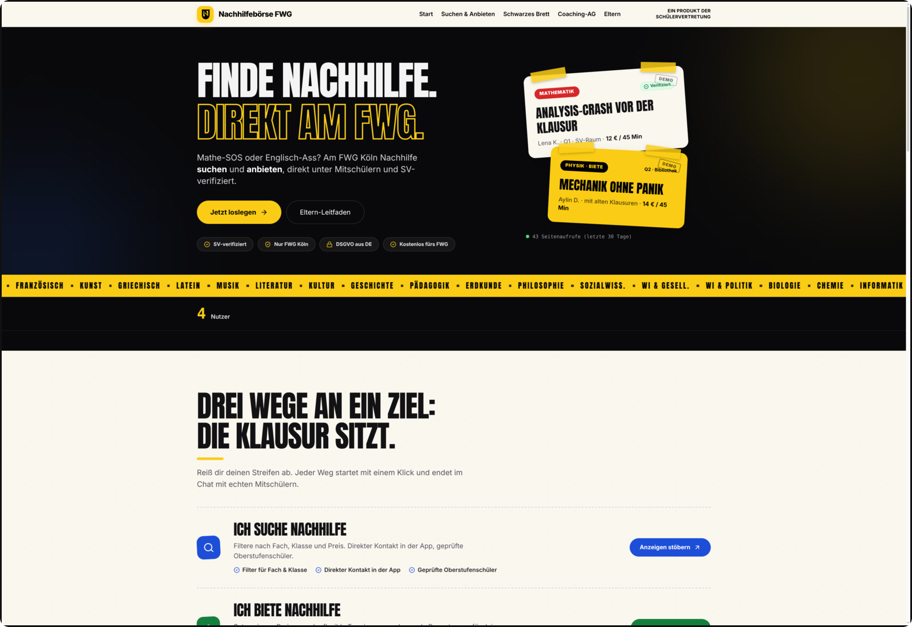
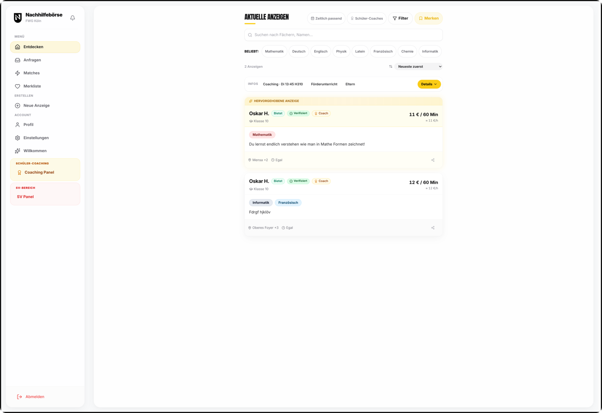
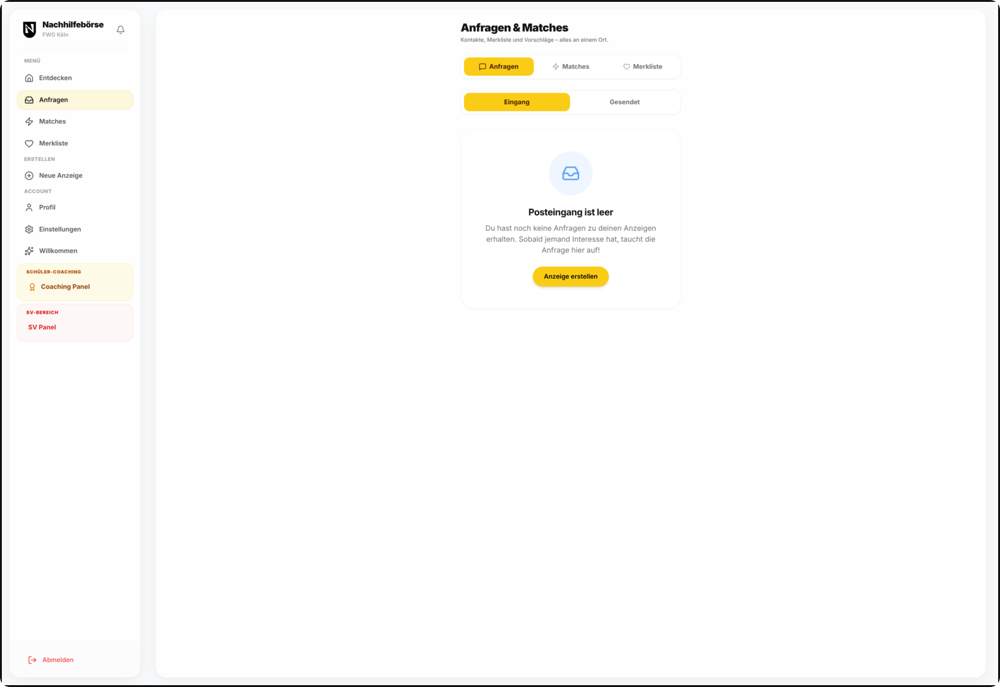
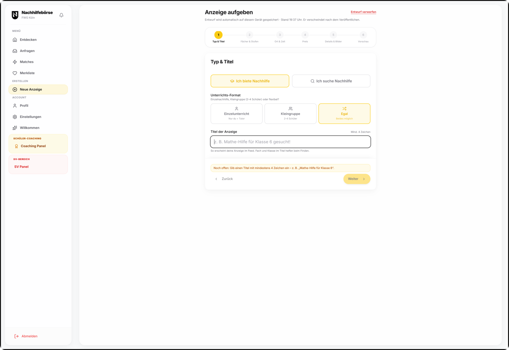
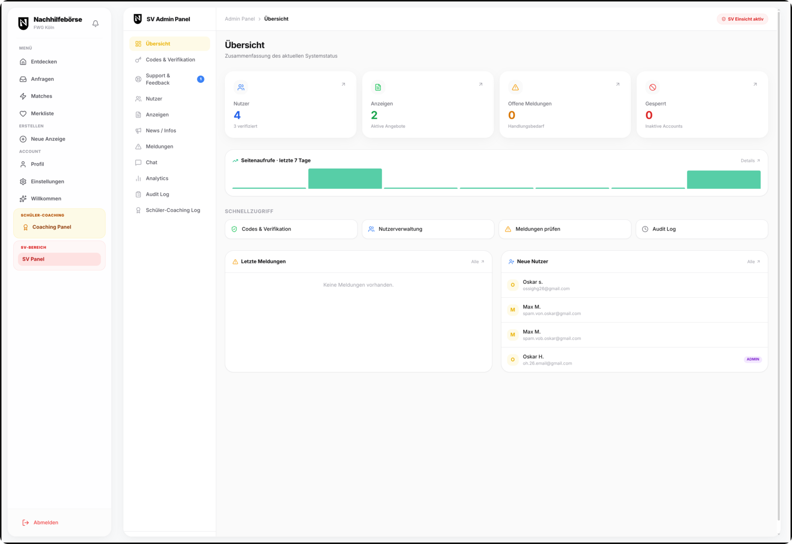
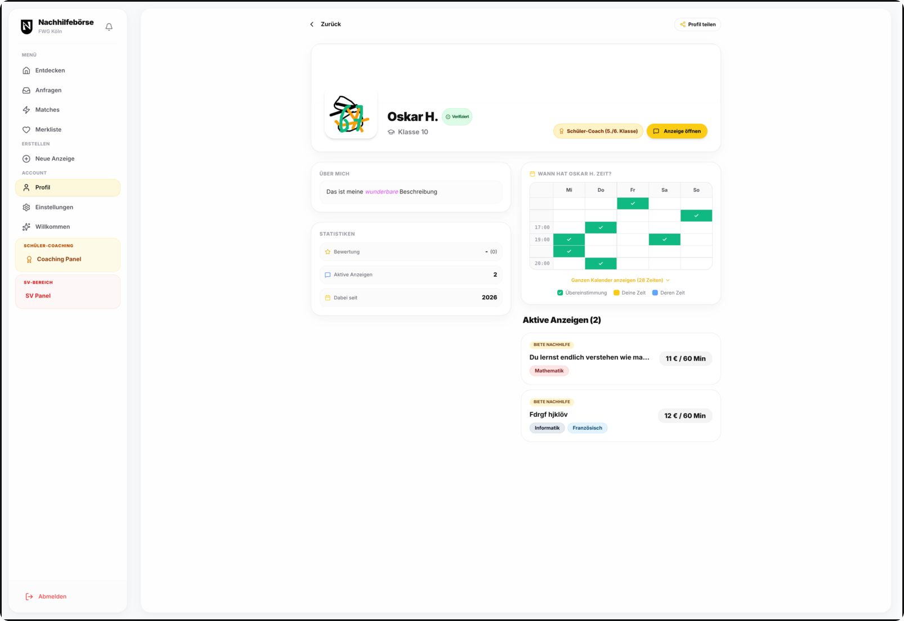
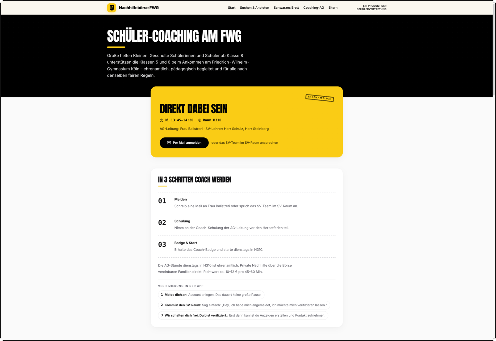
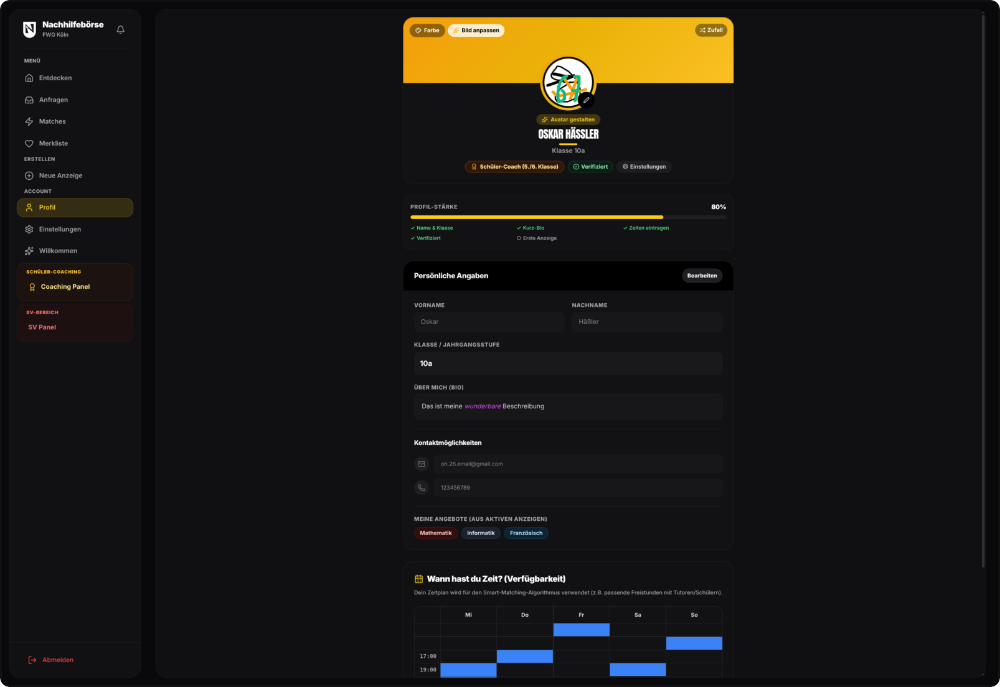

<div align="center">

# 🎓 FWG Nachhilfebörse

**Die schulinterne Nachhilfe-Plattform des Friedrich-Wilhelm-Gymnasiums Köln**  
Nachhilfe suchen und anbieten, direkt unter Mitschülern: ohne kommerzielle Plattform, moderiert von der SV.

[](https://nachhilfe-sv.de)
[](https://nachhilfe-sv.de)
[](https://github.com/oskar26/nachhilfeb-rse)
[](https://nachhilfe-sv.de/#/datenschutz)

</div>

---

## 📌 Was ist das?

Die **FWG Nachhilfebörse** ist eine Progressive Web App (PWA) für das FWG Köln: Schüler:innen der Klassen 5 bis 13 finden Nachhilfe oder bieten sie an. Dazu kommen Verifikation über die Schülervertretung, Chat, Eltern-Dashboard und Pflicht zum Jugendschutz.

| | |
|---|---|
| 🌐 **Website** | [https://nachhilfe-sv.de](https://nachhilfe-sv.de) |
| 💻 **Quellcode** | [github.com/oskar26/nachhilfeb-rse](https://github.com/oskar26/nachhilfeb-rse) |
| 🏫 **Träger** | Schülervertretung (SV) des Friedrich-Wilhelm-Gymnasiums Köln |
| 📄 **Rechtliches** | [Impressum](https://nachhilfe-sv.de/#/impressum) · [Datenschutz](https://nachhilfe-sv.de/#/datenschutz) · [Transparenz](https://nachhilfe-sv.de/#/transparenz) |

---

## 📸 Screenshots

> **Platzhalter:** Legt die Bilder unter `docs/screenshots/` ab. Dann erscheinen sie hier automatisch.  
> Benennung und Motive siehe [`docs/screenshots/README.md`](docs/screenshots/README.md).

| Startseite | Feed & Suche | Anfrage & Chat |
|:---:|:---:|:---:|
|  |  |  |

| Anzeige erstellen | Eltern-Dashboard | SV-Panel |
|:---:|:---:|:---:|
|  |  |  |

| Profil & Bewertung | Coaching | Dark Mode / PWA |
|:---:|:---:|:---:|
|  |  |  |

---

## ✨ Funktionen

<details>
<summary><b>Für Schüler:innen</b></summary>

- **🔍 Smart Matching:** Suche nach Fächern (nach Aufgabenfeldern farbcodiert), Klassenstufe (5–Q2), Preis, Ort und Verfügbarkeit
- **📝 Anzeigen in Minuten:** Stepper für „biete“ und „suche“, inkl. Bilder und Zeitfenstern
- **💬 Anfragen & Chat:** Terminabsprachen mit Match-Übersicht und Kalender-Export (ICS)
- **⭐ Bewertungen:** nur nach echtem Kontakt, keine Fake-Reviews
- **📌 Merkliste:** Anzeigen speichern und später vergleichen
- **👤 Profile mit Bio:** Rich-Text-Bio, Fach-Tags, Verifizierungs-Hinweis
- **🏅 Schüler-Coaching AG:** Badge für verifizierte Coaches ab Klasse 8

</details>

<details>
<summary><b>Für Eltern</b></summary>

- **👨‍👩‍👧 Eltern-Dashboard:** Kind verknüpfen, Fortschritt einsehen
- **🛡️ Leitfaden:** Was die Plattform kann, was sie nicht kann, wie Sicherheit funktioniert ([Eltern-Leitfaden](https://nachhilfe-sv.de/#/eltern-leitfaden))

</details>

<details>
<summary><b>Für die SV (Administration)</b></summary>

- **✅ Verifikation:** SV-Raum, Codes/QR, Vor-Ort-Freischaltung
- **🎟️ Promotion-Codes:** z. B. `BANANE` für den Start
- **📣 Moderation:** Reports, Nutzerverwaltung, Audit-Log
- **📊 Analytics:** Live-Stats (Anzeigen, Nutzer, Seitenaufrufe) ohne externe Tracker

</details>

<details>
<summary><b>Technisch</b></summary>

- **📱 PWA:** installierbar auf Handy und Desktop, Offline-Prompt, Bottom-Nav mobil / Sidebar Desktop
- **🌗 Dark & Light Mode**
- **🔔 News-Widget & Push-Hinweise**

</details>

---

## 📊 Projekt in Zahlen

<div align="center">

|  |  |  |  |
|:---:|:---:|:---:|:---:|
| **SQL-Migrationen** | **Seit Ende 2025** | **> 10 Monate** | **Agentisches Coding** |
|  |  |  |  |

</div>

---

## 🤖 Transparenz: KI-gestützte Entwicklung

Dieses Projekt ist **Open Source** und erklärt seine Entstehung offen, auch auf der Website: [Transparenzhinweis](https://nachhilfe-sv.de/#/transparenz).

- **Seit Ende 2025**, also **über zehn Monate**, entsteht die Nachhilfebörse im Wesentlichen durch **agentisches Coding**: KI-Agenten schreiben und iterieren den Code, ein Mensch setzt Ziele, prüft, entscheidet und dirigiert.
- Der Aufwand beläuft sich auf **mehrere hundert Stunden**. Oft laufen dafür lange Workflows über viele Tage und Wochen.
- Ein **großer Teil des Codes und der Texte ist AI-generated**. Das ist Absicht und wird hier nicht beschönigt: Die Plattform ist ein Schülerprojekt, das mit modernen Werkzeugen gebaut wird, nicht das Ergebnis eines klassischen Entwicklerteams.
- **Verantwortung bleibt menschlich:** Inhalte, Sicherheitskonzept, Datenschutz und Entscheidungen über Features prüft und trägt das SV-Team. Fehler und Lücken können trotzdem vorkommen. Feedback an [technik@nachhilfe-sv.de](mailto:technik@nachhilfe-sv.de) oder als [Issue auf GitHub](https://github.com/oskar26/nachhilfeb-rse/issues).

> Weniger Maschine. Mehr Haltung: Wir sagen, woher der Code kommt, damit ihr einschätzen könnt, was ihr benutzt.

---

## 🔒 Sicherheit & Datenschutz (DSGVO)

1. **Privatsphäre zuerst:** Inhalte sind nie automatisch öffentlich. Verifikation über den SV-Raum, 7-Tage-Aufräumjob für unverifizierte Konten.
2. **Serverseitiger Inhaltsfilter:** Profanity-Trigger auf Datenbankebene.
3. **Kein Tracking-Müll:** keine externen Analyse-/Werbedienste, Hosting in Deutschland.

Details: [Datenschutzerklärung](https://nachhilfe-sv.de/#/datenschutz) · [Cookies](https://nachhilfe-sv.de/#/cookies)

---

## 🛠️ Tech Stack

| Ebene | Technologien |
|---|---|
| **Frontend** | React 19, TypeScript, Vite, TailwindCSS, Framer Motion, Lucide Icons, Tiptap |
| **Backend & DB** | PHP-API (ALL-INKL MySQL) · Supabase-Adapter (PostgreSQL, RLS, Auth) |
| **PWA** | vite-plugin-pwa, Workbox |

---

## 📁 Datenbank-Updates

Schema und laufende Änderungen liegen unter [`sql/`](sql/) und [`sql-updates/`](sql-updates/).  
Reihenfolge und Import-Schritte (phpMyAdmin / ALL-INKL): siehe [`sql-updates/README.md`](sql-updates/README.md).

---

## 🗺️ Projektstruktur

```
nachhilfev2/
├── src/
│   ├── pages/          # Feed, Chat, Profile, Eltern, SV-Panel, Rechtliches …
│   ├── components/     # UI, Layout, Modals
│   ├── context/        # Auth, Theme
│   └── lib/            # API-Client, Analytics, Helpers
├── api/                # PHP-API (ALL-INKL)
├── netlify/functions/  # Netlify Functions
├── sql/ + sql-updates/ # Schema, Migrationen
├── test/               # Node-Tests
└── docs/               # Briefings, Screenshots
```

---

## 🤝 Mitmachen

1. Fork erzeugen und Branch anlegen
2. Änderung mit klarem Commit-Message
3. PR aufmachen und kurz beschreiben, was sich warum ändert

Issues und Fehler: [github.com/oskar26/nachhilfeb-rse/issues](https://github.com/oskar26/nachhilfeb-rse/issues)

---

## 📄 Lizenz & Rechte

Entwickelt für das **Friedrich-Wilhelm-Gymnasium Köln**, Betrieb durch die **Schülervertretung**.  
Quellcode öffentlich auf GitHub; die Plattform selbst ist ein **nicht-kommerzielles Schülerprojekt**.  
Rechtliches: [Impressum](https://nachhilfe-sv.de/#/impressum) · [Nutzungsbedingungen](https://nachhilfe-sv.de/#/nutzungsbedingungen)

---

<div align="center">

**[nachhilfe-sv.de](https://nachhilfe-sv.de)** · von Schülern, für Schüler, mit offenen Augen.

</div>
